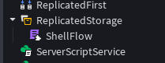
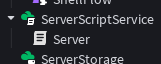
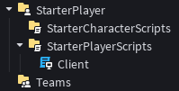

# ShellFlow: Roblox Networking API
ShellFlow is an API created inside Roblox Studio that acts as a Shell over RemoteEvents, allowing users to use RemoteEvents safely without having to worry about unexpected interruptions. ShellFlow keeps events hidden and secure with confirmation into an event, and confirmation outside an event; and it's extremely simple! I created this project a couple months ago, and I have just started working on it again, as I need it for my Roblox project.
## The Basics
First, we'll have to go over the basics. ShellFlow is currently in `V1.0.0` as of righting this, so expect things to not function correctly. However, if your version is in `V1.X.X`, then this guide should still be up to date; with less bugs. Anyway, enough blabbering. First, you'll have to go the
[ShellFlow](https://youtube.com/watch?v=dQw4w9WgXcQ) place, then insert it into **ReplicatedStorage**.



Next, setup a Server script in **ServerScriptService**, and a Client script in **StarterPlayerScripts**.




------
Inside both scripts, we can require ShellFlow and *do some stuff*. Below listed are the scripts for both the Client and Server, creating a simple Server → Client messenger.
```lua
--- SERVER SCRIPT ---
-- Requiring ShellFlow
local shellFlow = require(game.ReplicatedStorage.ShellFlow)

-- Initialising the Server
shellFlow.server.Init()

-- Creating an event with parameters:
-- · "Name" is the identifier of the event, used to find the event...
-- · "Type" has to be "RemoteEvent", as other types aren't supported yet...
-- · "Client Limit" is a safety feature. Think of it as slots; how many clients have access to this event?
local event = shellFlow.server.StoreEvent("Event", "RemoteEvent", 1)

-- Fires the event to all clients
event:FireAllClients("Hello, World from the Server!")
```

```lua
--- CLIENT SCRIPT ---
-- Requiring ShellFlow
local shellFlow = require(game.ReplicatedStorage.ShellFlow)

-- Reading the event created from the Server
local event = shellFlow.client.ReadEvent("Event")

-- Linking the event instance to a function
event.OnClientEvent:Connect(function(message)
	print("SERVER SAID: " .. tostring(message))
end)
```
------
Hey! You've got yourself a neat messenger!
## Session Locking
ShellFlow automatically handles a ***lot*** of the security inside the module itself, but still needs some input from the user. If you look into the ShellFlow module enough, you can notice that ShellFlow creates a folder of events and keeps it within itself. Untrustworthy clients can just abuse the events from there, right?

You are completely correct. This is where session keys come in. Each time a client requests access to an event, it's given a special code that is needed to access events. Now, the server receiving the input from the client will request of the code from ShellFlow, then compare it to the client's session key. If it matches, then the code is executed. Otherwise, they're blocked.

Below, you can see a Client → Server messenger with session keys implemented too.

```lua
--- SERVER SCRIPT ---
-- Requiring ShellFlow
local shellFlow = require(game.ReplicatedStorage.ShellFlow)

-- Initialising the Server
shellFlow.server.Init()

-- Creating an event with a 1-client limit
local event = shellFlow.server.StoreEvent("Event", "RemoteEvent", 1)

-- Linking a function to the event with a sessionKey parameter
event.OnServerEvent:Connect(function(player, message, sessionKey)
  -- Reads the key; automatically sends player data too
	local key = shellFlow.server.ReadKey("Event")

  -- Checks if the correct key matches with the key given by the player
	if sessionKey==key then
    -- Success!
		print("CLIENT SAID: " .. tostring(message))
	else
    -- FAILURE.
    -- Increases the clientLimit, as this client is untrustworthy
		local clientLimit = event:GetAttribute("ClientLimit")
		event:SetAttribute("ClientLimit", clientLimit+1)

		print("LIAR!")
	end
end)
```

```lua
--- CLIENT SCRIPT ---
-- Requiring ShellFlow
local shellFlow = require(game.ReplicatedStorage.ShellFlow)

-- Reading the event created from the Server and grabbing the key
local event, key = shellFlow.client.ReadEvent("Event")

-- Linking the event instance to a function
event:FireServer("Hello, from the client!", key)
event:FireServer("Hello, from the EVIL client!", key+1)
```
------
As you can see from above, the client sends out 2 packages; 1 correct, and 1 wrong. If you run the code, the faulty package would be ignored for having the wrong session key. There's one more feature that I have yet to show you...
## External Logging
Yes, there is a logging system that doesn't take up all the space in the `Output`. Instead, all the logs are saved into a table, and is saved inside `ShellFlow.logs`. Logs are saved separately and are not merged. I'll see if I can fix this in the near future. Anyway, you can create a log using `ShellFlow.server.Log("Message", 1)` or `ShellFlow.client.Log("Message", 2)`. They'll bug out if the wrong version is used on the wrong viewer. Anyway, here's the full code without any comments, and with the logging system embedded.

```lua
--- SERVER SCRIPT ---
local shellFlow = require(game.ReplicatedStorage.ShellFlow)

shellFlow.server.Init()

local event = shellFlow.server.StoreEvent("Event", "RemoteEvent", 1)

local log = shellFlow.server.Log

task.wait(1)

event.OnServerEvent:Connect(function(player, message, sessionKey)
	log("OnServerEvent", 1)

	local key = shellFlow.server.ReadKey("Event")

	if sessionKey==key then
		log("Session Key Matched", 1)

		print("CLIENT SAID: " .. tostring(message))
	else
		log("Session Key Didn't match; untruthful client", 2)

		local clientLimit = event:GetAttribute("ClientLimit")
		event:SetAttribute("ClientLimit", clientLimit+1)

		print("LIAR!")
	end
end)

task.wait(3)

print(shellFlow.logs, "From the server!")
```

```lua
--- CLIENT SCRIPT ---
local shellFlow = require(game.ReplicatedStorage.ShellFlow)

task.wait(1)

local log = shellFlow.server.Log

log("Obtained Event + key", 1)
local event, key = shellFlow.client.ReadEvent("Event")

log("FireServer", 1)
event:FireServer("this is a passed down message", key)

task.wait(3)

print(shellFlow.logs, "From the client!")
```
